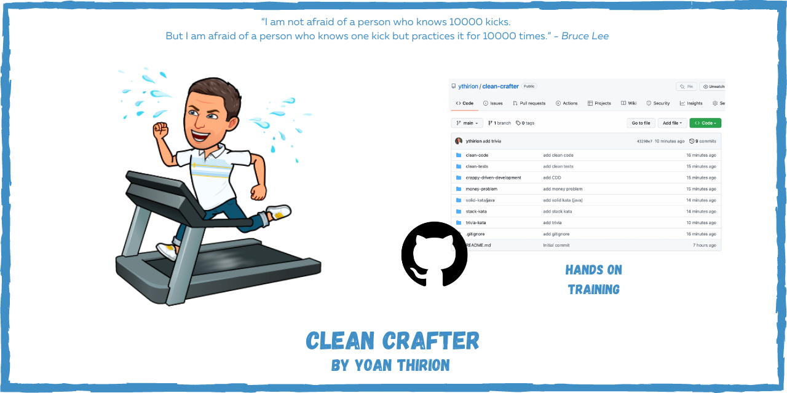

# Clean Crafter
Code for clean crafter training

## Day 1
- [Clean Code](clean-code/README.md)
- [S.O.L.I.D kata](clean-code/README.md)
- [Ugly Trivia refactoring kata](trivia-kata/README.md)

## Day 2
- [Stack kata](stack-kata/README.md)
- [Money problem](money-problem/README.md)
- [Clean Tests](clean-tests/README.md)

## Prerequisites
* Java : > 11
* C# : > .NET 6

