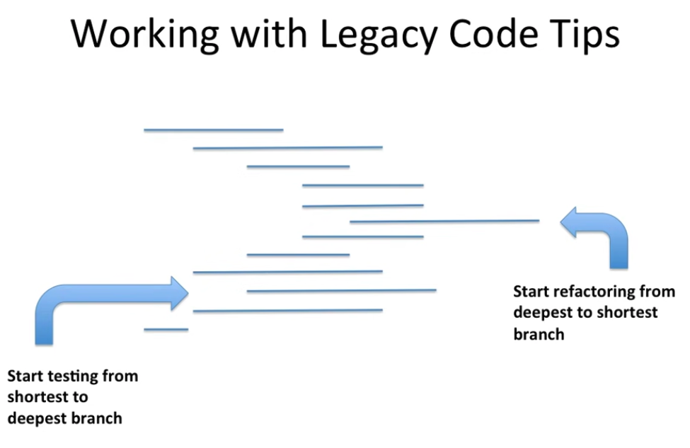

# Trip Service Kata
> Challenge for today : refactor the `TripService` class to ensure Clean Code / SOLID principles

The end result should be well-crafted code that express the domain.

- Legacy code golden rule :
  `You cannot change any existing code if not covered by tests.`
  - The only exception is if we need to change the code to add unit tests, but in this case, just automated refactorings (via IDE) are allowed.

## Tips
- Start testing from shortest to deepest branch
- Start refactoring from deepest to shortest branch

Step-by-step solution available in [java](java/step-by-step.md) and [scala](scala/solution/step-by-step.md)

## Sources 
- [Original kata](https://github.com/sandromancuso/trip-service-kata/)
- [Sandro Mancuso - Testing legacy with Hard-wired dependencies](https://www.codurance.com/publications/2011/07/16/testing-legacy-hard-wired-dependencies)
- [Nicolas Carlo - understand legacy code](https://understandlegacycode.com/blog/key-points-of-working-effectively-with-legacy-code/#identify-seams-to-break-your-code-dependencies)
- [Micheal Feathers - Working Effectively with Legacy Code](https://www.oreilly.com/library/view/working-effectively-with/0131177052/)

