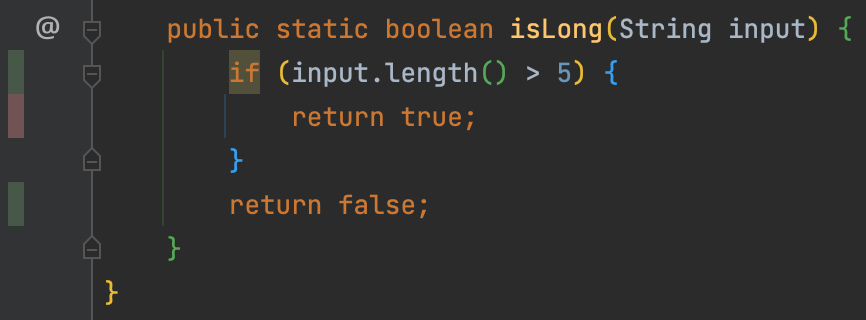
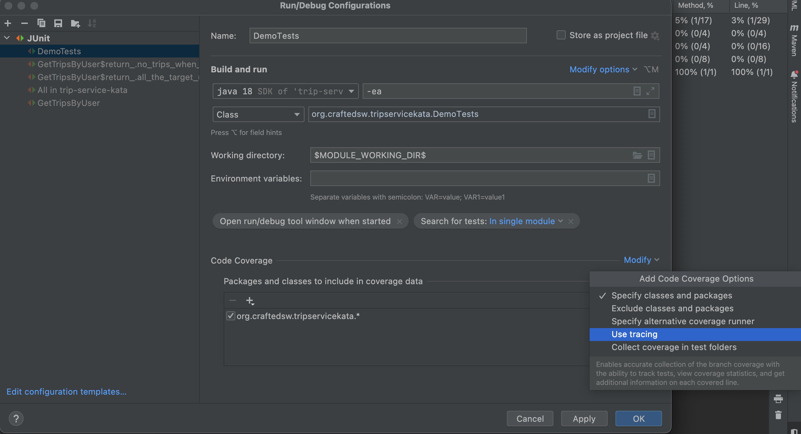
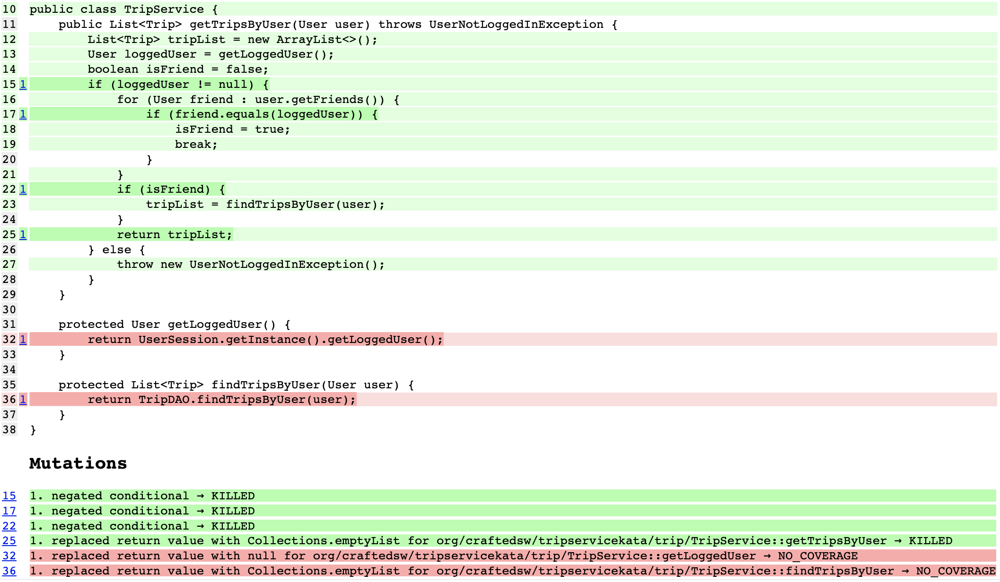

## Improve confidence in our tests
> How could we do it?

- Is `code coverage` a quality metric?

### A word on code coverage
Let's take an example:
```java
@UtilityClass
public class Demo {
    public static boolean isLong(String input) {
        if(input.length() > 5) {
            return true;
        }
        return false;
    }
}
```

Write a test:
```java
class DemoTests {
    @Test
    void should_return_false_for_abc() {
        assertThat(Demo.isLong("abc")).isFalse();
    }
}
```
- Line coverage = `Lines of code executed` / `Total number of lines`
  - Here `66%` of code coverage



- How could I improve it without adding tests?
  - Use ternary operator

```java
public static boolean isLong(String input) {
    return input.length() > 5;
}
```


- Could we use a better metric?
  - Branch coverage = `Branches traversed` / `Total number of branches`


- The 2 modes are available through `IntelliJ`
  - `Sampling` : collecting line coverage with negligible slowdown
  - `Tracing`: enables the accurate collection of the branch coverage



- Is branch coverage enough to assess test quality?
  - With the test below the `branch coverage` is still at `50%`...

```java
class DemoTests {
    @Test
    void should_return_false_for_abc() {
        Demo.isLong("abc");
        // Assertion free test
    }
}
```

> Coverage metrics are a good negative indicator BUT a bad positive one...

### Mutation Testing
Let's assess the quality of our tests by using [mutation testing](https://xtrem-tdd.netlify.app/Flavours/mutation-testing)

- Test our tests by introducing MUTANTS (fault) into our production code during the test execution :
  - To check that the test is failing 
  - If the test pass, there is an issue
- We can introduce mutants manually 
  - When working on legacy code for example 
  - When doing some TDD

Let's use an automation tool, in `java` we can use [pitest](https://pitest.org/)

List of available mutators available [here](https://pitest.org/quickstart/mutators/)

```xml
<properties>
    ...
    <pitest.version>1.9.0</pitest.version>
    <pitest.junit5.version>1.0.0</pitest.junit5.version>
</properties>

<dependencies>
    ...
    <dependency>
        <groupId>org.pitest</groupId>
        <artifactId>pitest-junit5-plugin</artifactId>
        <version>${pitest.junit5.version}</version>
        <scope>test</scope>
    </dependency>
</dependencies>
<plugins>
    <plugin>
        <groupId>org.pitest</groupId>
        <artifactId>pitest-maven</artifactId>
        <version>${pitest.version}</version>
    </plugin>
</plugins>
```

- Use the plugin and assess the generated report



- Not that much to say on it...
  - It has improved our confidence on our tests

### Introduce mutants for fun